<h1 align="center">Tsellios K9 Academy</h1>

<h2 align="center">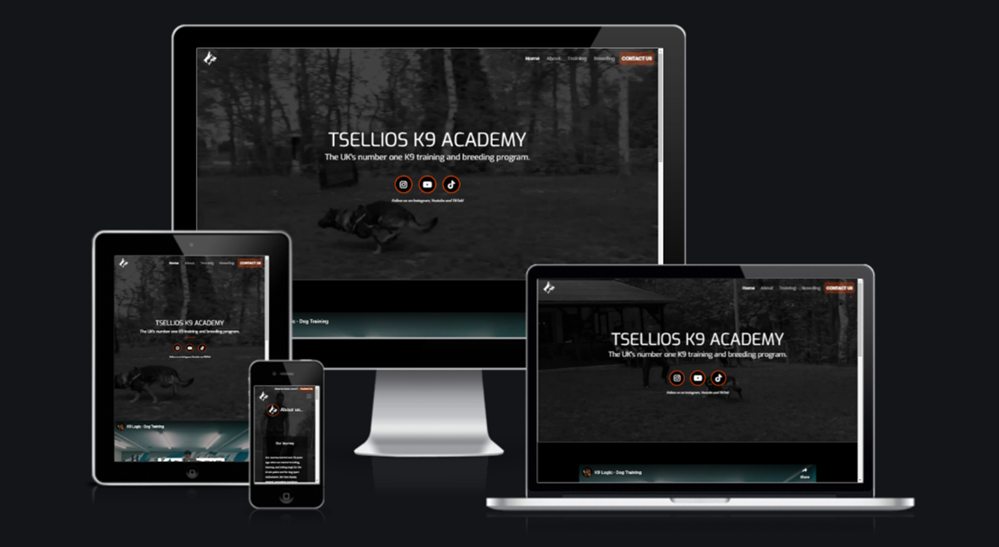</h2>

<h1 align="center"></h1>

## **Project Overview**
[View the live project here.](http://www.tselliosk9academy.co.uk/)

This is the main marketing website for Tsellios K9 Academy. It is designed to be responsive and accessible on both mobile and desktop devices, making it easy to both use and navigate for potential customers.

This is the first milestone project completed by myself while working towards my qualification with the Code Institute. 

The main goal of the Tsellios K9 Academy website, is to market the dog training and breeding services of the business owner and promote their social media accounts to build a strong online presence. 

# **CONTENT** 

- [Project Overview](#project-overview "Project Overview")
- [User Experience](#user-experience "User Experience")
- [Technologies Used](#technologies-used "Technologies Used")
- [Testing](#testing "Testing")
- [Deployment](#deployment "Deployment")
- [Credits](#credits "Credits")
- [Acknowledgements](#acknowledgements "Acknowledgements")

## **User Experience** (UX)

---

### Strategy

### **Target Audience**

- Aspiring security dog handlers.
- Existing security dog handlers.
- Domestic dog owners. 
- Potential new dog owners.
- Dog owners with training needs.

### **User Needs**

- High quality, easily accessible online learning resources.
- One to one training sessions.
- Ability to enquire about buying trained puppies.
- Guidance on best training practices.

### **Business Goals**

- Promote social media pages to grow the business's online community.
- Market the business's services online.
- Promote the online training academy.
- Educate dog owners on good training techniques.
- Create revenue through training and selling of animals.

### **User Goals**

- Find information about dog training.
- Find information about breeding services.
- Find links to social media to stay up to date with the community.
- Contact the business to ask questions.

### **User Stories**

 -   #### First Time Visitor Goals

        1. As a First Time Visitor, I want to easily understand the main services offered by Tsellios K9 Academy and learn more about the organisation.
        2. As a First Time Visitor, I want to be able to easily navigate through the various areas of the website to find content.
        3. As a First Time Visitor, I also want to locate their social media links to see how their brand interacts with customers.

  -   #### Returning Visitor Goals

        1. As a Returning Visitor, I want to find information about K9 training services.
        2. As a Returning Visitor, I want to find the best way to get in contact with Tsellios K9 Academy with any questions I may have.
 

 -   #### Frequent User Goals
        1. As a Frequent User, I want to check to see if there are any newly added dog training services.
        2. As a Frequent User, I want to check to see if there are any new social media posts or updates.
        3. As a Frequent User, I want to sign up for the newsletter so that I am notified of major updates and/or changes to the company's website and/or services.

### Scope

### **Website Functionality Considerations:**

- User friendly.
- Accessible.
- Fully responsive.
- Clear business overview.
- Training services.
- Ability to contact the business.
- The website needs captivating media, including large videos and images.
- The website needs interactive elements.

---

### Skeleton

## **Wireframes**
 

 **Created with Draw.io**  
 
 GitHub Link - [View](https://github.com/Zach-Deladev/milestone-project-frontend/blob/main/assets/images/readme/wireframes-picture.png) [Insert path]

<h2 align="center"></h2>
   
---

### Structure

## **Existing Features**

### **Navigation:**

1. Every page has a simple yet effection Navigation bar that is transparent but transitions to black on the scroll of the page to stop content overlap.

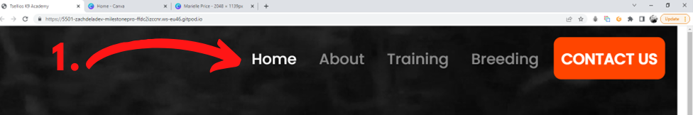

2. The navigation bar is also responsive and collapses on smaller screen sizes into a "burger" menu to keep the design clean and simple.

3. I implemented a hover effect when the user highlights a menu item to give the navigation menu an interactive feel.

4. I also added an orange background to the "contact us" menu item to divert the user's attention to the contact page. On smaller screens where the menu collapses, I added an alert above the navbar to have the same desired outcome.

### **Header:**

1. Every page has a consistent header with an H1 element and a background image.

### **Body:**

1. Every page follows the same content structure:
    
    - The website's text containers have an RGBA transparent background which helps the text stand out from the background image giving a clear contrast and making the text easy to read.
    - Each section of the content is clearly defined with a new heading making the flow of information easy to follow.
    - Each page divides the text with either images or videos to keep the user's attention for longer. 

### **Footer:**

1. Every page has the same styled footer:

    - The footer includes interactive social media icons to guide the user to the respective social media profiles.
    - The footer also has quick links to the site's different pages so the user can quickly navigate the site.
    - The footer is responsive on all screen sizes.

### **index.html *"Page"*:**
1. Hero marketing video to instantly engage the user:
    - This video covers 80% of the viewport height leaving 20% of the section below slightly visible to make the user aware that there is the content underneath.
    - I added greyscale to the video to make the content on top stand out and to make sure there's a clear contrast between the background and the content.

2. Social media icons to direct the user to the social media pages to build an online following:

    - Keeping in line with the business goals and chosen colour palette I used a subtle orange border around the social media icons to direct the user's attention.
    - To make the user feel engaged with the site I added hover effects to the icons so they change colour when the cursor hovers over them.
    - Each Social media icon links directly to the business owner's respective social media profiles in a separate browser tab so the user does not lose their position on the page within the website.
    

3. Business heading and title:

    - The heading was made using a Jumbotron and gives a short but descriptive overview of the business.

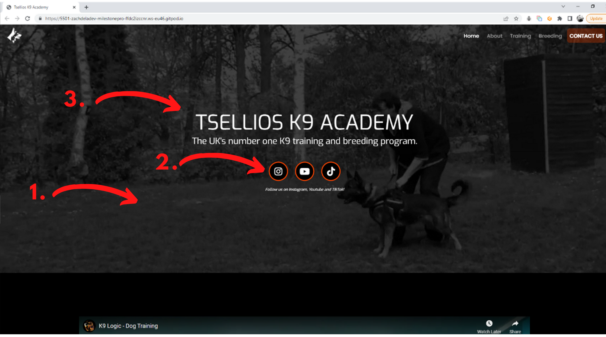

4. Testimonials section:

    - The testimonials section helps the user decide on their first impressions of whether the company is reputable or not.
    - The testimonials on the site are real-life testimonials for the business provided by the business owner.
    - The testimonials are a custom card design I created which is responsive on different screen sizes.
    - To keep in line with the colour palette I added a background colour or orange to them.

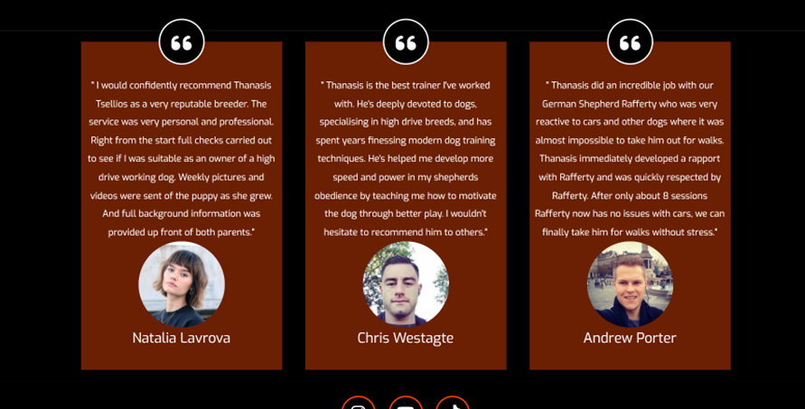

### **about.html *"Page"*:**

1. Overview of the origin and journey of the business. 

2. What we do section:

    - These images are interactive and on hover, an orange overlay appears with text guiding the user to click on them to find out more.

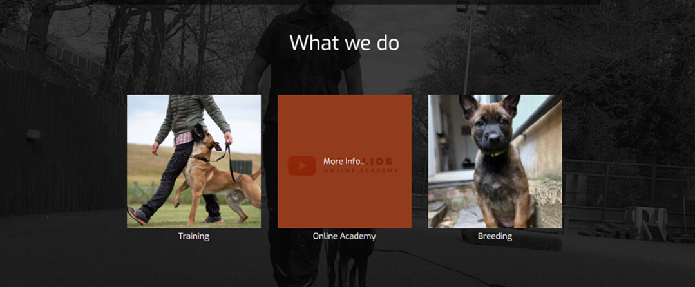

3. Our mission section is to give confidence to the user that the business aligns with their needs.

4. A small gallery of photos of the staff training with their dogs.

    - This gallery uses a Bootstrap grid to make it responsive.
    - All images are free from stretch and pixelation.
    - All images have relevant alternative text equivalents for the visually impaired.

### **training.html *"Page"*:**

1. Behavioural training section:

    - This section includes a text container that gives a brief overview of the service offered.
    - This section also includes a responsive iframe with an embedded youtube marketing video to engage the user and deliver information in a fun easy to digest way.

2. Protection training section:

    - This section includes a text container that gives a brief overview of the service offered.
    - This section also includes a responsive iframe with an embedded youtube marketing video to engage the user and deliver information in a fun easy to digest way.

3. Online academy section:

    - Coming soon section detailing the upcoming online academy.
    - This section also includes a responsive iframe with an embedded youtube marketing video to engage the user and deliver information in a fun easy to digest way.
    - Training modules overview in the style of orange cards giving information on the training modules the product will offer.

### **breeding.html *"Page"*:**

1. Summary of the breeding services of the business.

2. Gallery of puppies:

    - Display in a bootstrap grid style gallery. 
    - Using a fancy box gallery so the user can view the full sized images full screen and click through the image carousel.

### **contact.html *"Page"*:**

1. Contact form:

    - The contact form is clear and prompts the user on what information is needed in each field.
    - Orange interactive send message button that the colour changes on hover.

## **Future Iterations**

**Online Academy *"Page"*:**

    - The site will eventually be updated with the ability to sign up and log in to the online academy where users can sample for free and purchase online instructional training videos.
    - The online academy will also have the option to book one to one online sessions with a trainer to discuss training needs.

**Online Store *"Page"*:**
- The site will also open an online store once a large enough social media following and community have been built selling merchandise, accessories and dog-related products.

---
### Surface

## **Typography**

-   In this project I used the Exo font for titles and headings and Poppins for the main text, I also set a fallback font of sans-serif for cross-browser compatibility.

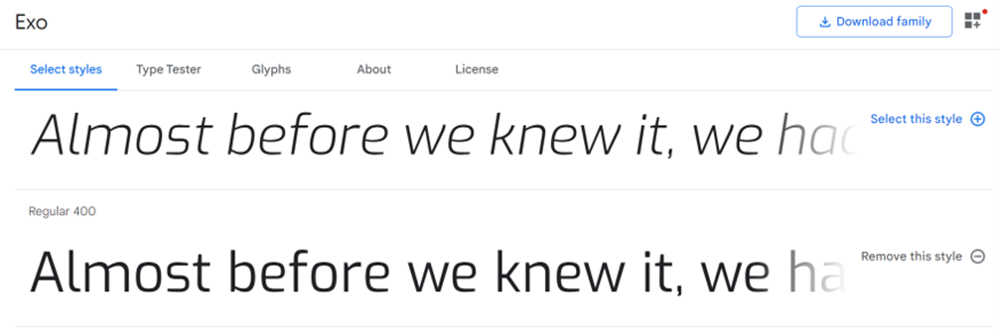
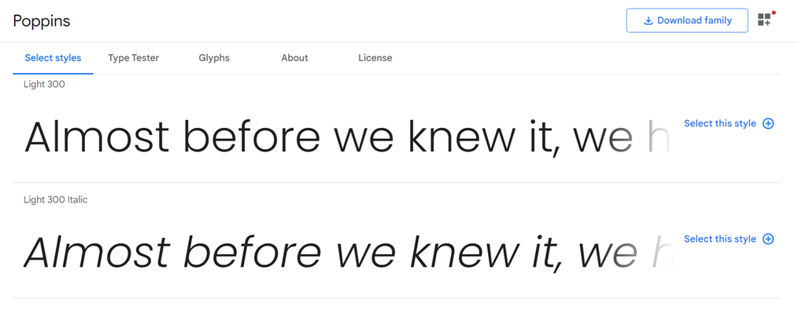

## **Color Scheme**

-   The three main colours used are black, grey, and white. 
-   There is also subtle use of the OrangeRed color to draw user attention.
        

---

## Technologies Used

### Languages Used

-   [HTML5](https://en.wikipedia.org/wiki/HTML5)
-   [CSS3](https://en.wikipedia.org/wiki/Cascading_Style_Sheets)
-   [Javascript](https://en.wikipedia.org/wiki/JavaScript)

### Frameworks, Libraries & Programs Used

1. [Bootstrap 4.4.1:](https://getbootstrap.com/docs/4.4/getting-started/introduction/)
    - Bootstrap was used to assist with the responsiveness and styling of the website.
1. [Hover.css:](https://ianlunn.github.io/Hover/)
    - Hover.css was used on the Social Media icons in the footer to add the float transition while being hovered over.
1. [Google Fonts:](https://fonts.google.com/)
    - Google fonts were used to import the 'Titillium Web' font into the style.css file which is used on all pages throughout the project.
1. [Font Awesome:](https://fontawesome.com/)
    - Font Awesome was used on all pages throughout the website to add icons for aesthetic and UX purposes.
1. [jQuery:](https://jquery.com/)
    - jQuery came with Bootstrap to make the navbar responsive but was also used for the smooth scroll function in JavaScript.
1. [Git](https://git-scm.com/)
    - Git was used for version control by utilizing the Gitpod terminal to commit to Git and Push to GitHub.
1. [GitHub:](https://github.com/)
    - GitHub is used to store the projects code after being pushed from Git.
1. [Photoshop:](https://www.adobe.com/ie/products/photoshop.html)
    - Photoshop was used to create the logo, resizing images and editing photos for the website.
1. [Draw:](https://draw.io/)
    - Draw.io was used to create the [wireframes](https://github.com/) during the design process.

## Testing

The W3C Markup Validator and W3C CSS Validator Services were used to validate every page of the project to ensure there were no syntax errors in the project.

-   [W3C Markup Validator](https://jigsaw.w3.org/css-validator/#validate_by_input) - [Results]
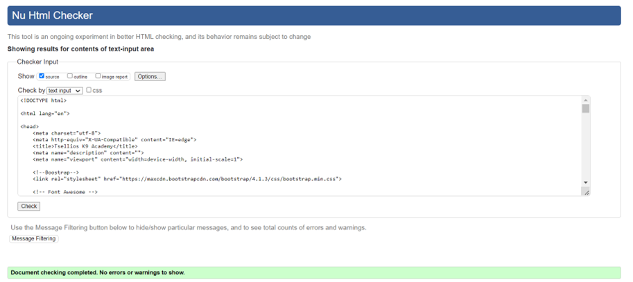

-   [W3C CSS Validator](https://jigsaw.w3.org/css-validator/#validate_by_input) - [Results]
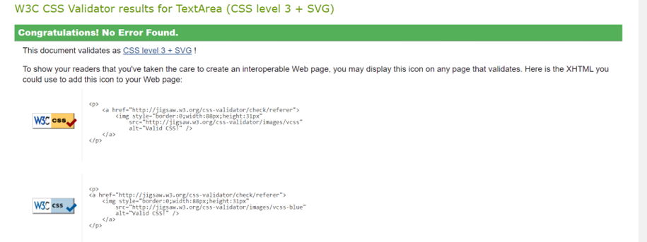

### Testing User Stories from User Experience (UX) Section

-   #### Real User stories testing:

    1. First Time Visitor, first impressions:

        1. "The heading of the website made it immediately obvious what the business specializes in."
        2. "From first glance, the navigation was very self-explanatory guiding me to exactly the information I needed."
        3. "Instantly from opening the site I saw links to the business's social media pages and the design drew my attention to them straight away."

    2. Returning Visitor stories:

        1. "After leaving the site to view the social media pages I returned to find out more about the training services, the information needed was easily found and this prompted me to contact the business within the contact page to ask for further information."

    3. Frequent User stories:
        1. "As someone keen to keep up to date with the businesses services I followed their social media where I can keep checking for updates to their services and more information on the release of the online academy which I am excited about!"
        2. It would be nice if there was a newsletter I could sign up to receive updates by email."

### Further Testing

-   The Website was tested on Google Chrome, Internet Explorer, Microsoft Edge and Safari browsers.
-   The website was viewed on a variety of devices such as desktops, laptops, Ipad Air, Ipad Mini, iPhone SE, Samsung Galaxy s8 & Samsung Galaxy s20 ultra.
-   Friends and family were asked to test the website on a range of devices and their experiences were noted.
- I also tested the performance of the website using the lighthouse feature in the browser dev tools. 
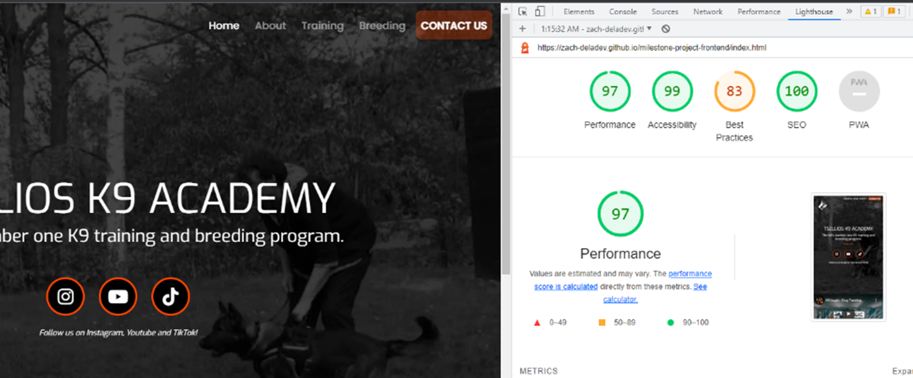

- The best practices section gave me some feedback but after careful consideration, I decided to disregard these to keep the aesthetic of the site.

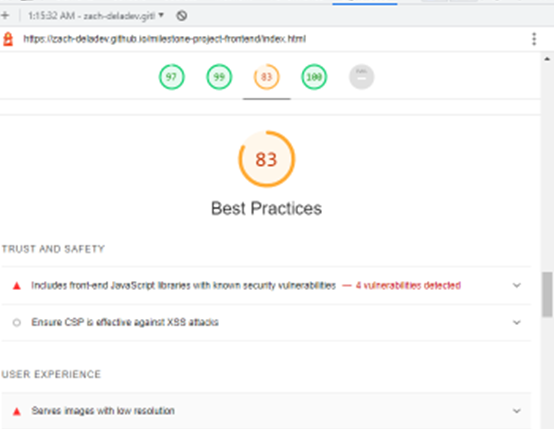

### Known Bugs

-   [List bugs]

---

## Deployment

### GitHub Pages

The project was deployed to GitHub Pages using the following steps...

1. Select the Settings tab in your GitHub repository. 

2. Locate the GitHub Pages section and chose the master branch (mine was called "main") as the source to enable GitHub Pages.

3. Save the master branch as the source, wait till the page refreshes and locate the URL to the deployed website.

4. Test the URL to make sure the website has deployed properly.

---

## Credits

### Code

-   The full-screen hero video code came from this [StackOverflow post](https://stackoverflow.com) [Insert link to youtube video]

-   [Bootstrap4](https://getbootstrap.com/docs/4.4/getting-started/introduction/): Bootstrap Library used throughout the project mainly to make site responsive using the Bootstrap Grid System.

-   [MDN Web Docs](https://developer.mozilla.org/) : For Pattern Validation code. Code was modified to better fit my needs and to match an Irish phone number layout to ensure correct validation. Tutorial Found [Here](https://developer.mozilla.org/en-US/docs/Web/HTML/Element/input/tel#Pattern_validation)

### Content

-   All content was written by the developer.

### Media

-   All Images were created by the developer.
-   Videos were sourced from youtube.

### Acknowledgements

-   My Mentor Guido for continuous helpful feedback.

-   Tutor support at Code Institute for their support.
