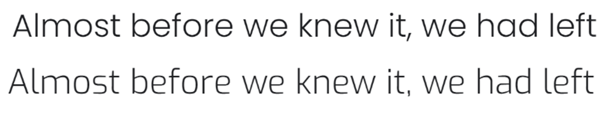

<h1 align="center">Tsellios K9 Academy</h1>


<h2 align="center"></h2>

<h1 align="center"></h1>

## **Project Overview**
[View the live project here.](https://example.com)

This is the main marketing website for Tsellios K9 Academy. It is designed to be responsive and accessible on both mobile and desktop devices, making it easy to both use and navigate for potential customers.

This project is the first milestone project completed by myself while working towards my qualification with the Code Institute. 

The main goal of the Tsellios K9 Academy website is to market the dog training and breeding services of the business owner and promoting their social media accounts to build a strong online following. 

# **CONTENT** 

- [Project Overview](#project-overview "Project Overview")
- [UX Design](#user-experience "User Design")
  - [Strategy Plane](#strategy-plane "Strategy Plane")
  - [Scope plane](#scope-plane "Scope plane")
  - [Structure Plane](#structure-plane "Structure plane")
  - [Skeleton Plane](#skeleton-plane "Skeleton Plane")
  - [Surface Plane](#surface-plane "Surface Plane")
- [Technologies Used](#technologies-used "Technologies Used")
- [Testing](#testing "Testing")
- [Deployment](#deployment "Deployment")
- [Credits](#credits "Credits")
- [Acknowledgements](#acknowledgements "Acknowledgements")

## User Experience (UX)

## **Strategy Plane** 
---
### **Target Audience**

- Aspiring security dog handlers.
- Existing security dog habndlers.
- Domestic dog owners. 
- Potential new dog owners.
- Dog owners with training needs.s

### **User Needs**

- High quality, easily accessible online learning resources.
- One to one training sessions.
- Ability to enquire about buying trained puppies.
- Guidance on best training practices.

### **Business Goals**

- Promote social media pages to grow the businesses online community.
- Market the businesses services online.
- Promote the online training academy.
- Educate dog owners on good training techniques.
- Create revenue through training and selling of animals.

### **User Goals**

- Find information about dog training.
- Find information about breeding services.
- Find links to social media to stay up to date with the community.
- Contact the business to ask questions.

### **User Stories**

 -   #### First Time Visitor Goals

        1. As a First Time Visitor, I want to easily understand the main services offered by Tsellios K9 Academy and learn more about the organisation.
        2. As a First Time Visitor, I want to be able to easily navigate through the various areas of the website to find content.
        3. As a First Time Visitor, I also want to locate their social media links to see how their brand interacts with customers.


  -   #### Returning Visitor Goals

        1. As a Returning Visitor, I want to find information about K9 training services.
        2. As a Returning Visitor, I want to find the best way to get in contact with Tsellios K9 Academy with any questions I may have.
 


 -   #### Frequent User Goals
        1. As a Frequent User, I want to check to see if there are any newly added dog training services.
        2. As a Frequent User, I want to check to see if there's any new social media posts or updates.
        3. As a Frequent User, I want to sign up to the Newsletter so that I am notified of major updates and/or changes to the companies website and/or services.


### **Website Functionality**

- User friendly.
- Responsive.
- Business overview.
- Training services.
- Ability to ask questions by email.
- Educational videos. 

## **Scope Plane**
---
### **Existing Features**

**Home *"Page"*:**

- 

**About Me *"Page"*:**

- 

**Contact Us *"Page"*:**

- 

### **Future Iterations**


## **Structure Plane**

### **Website Structure**

### **Planned Structure**

### **Future Additions**


## **Skeleton Plane**
---
### **Wireframes**
 

 **Created with Draw.io**  
 
 GitHub Link - [View](https://github.com/) [Insert path]

<h2 align="center"></h2>


## **Surface Plane**    
---
### **Typography**


-   [Include details about the font you used, and their style].




### **Color Scheme**

-   The three main colours used are black, grey, and white. 
-   There is also subtle use of the OrangeRed color to draw user attention.
        


### **Media**

 -   The large, background hero video is designed to be catch the potential customers attention. It quickly displays social media links to guide traffic and build a social media following.


## Features

-   The webiste is responsive on all device sizes
-   The website displays captivating media, including large videos and images
-   The website contains interactive elements and button hover animations

## Technologies Used

### Languages Used

-   [HTML5](https://en.wikipedia.org/wiki/HTML5)
-   [CSS3](https://en.wikipedia.org/wiki/Cascading_Style_Sheets)
-   [Javascript](https://en.wikipedia.org/wiki/JavaScript)

### Frameworks, Libraries & Programs Used

1. [Bootstrap 4.4.1:](https://getbootstrap.com/docs/4.4/getting-started/introduction/)
    - Bootstrap was used to assist with the responsiveness and styling of the website.
1. [Hover.css:](https://ianlunn.github.io/Hover/)
    - Hover.css was used on the Social Media icons in the footer to add the float transition while being hovered over.
1. [Google Fonts:](https://fonts.google.com/)
    - Google fonts were used to import the 'Titillium Web' font into the style.css file which is used on all pages throughout the project.
1. [Font Awesome:](https://fontawesome.com/)
    - Font Awesome was used on all pages throughout the website to add icons for aesthetic and UX purposes.
1. [jQuery:](https://jquery.com/)
    - jQuery came with Bootstrap to make the navbar responsive but was also used for the smooth scroll function in JavaScript.
1. [Git](https://git-scm.com/)
    - Git was used for version control by utilizing the Gitpod terminal to commit to Git and Push to GitHub.
1. [GitHub:](https://github.com/)
    - GitHub is used to store the projects code after being pushed from Git.
1. [Photoshop:](https://www.adobe.com/ie/products/photoshop.html)
    - Photoshop was used to create the logo, resizing images and editing photos for the website.
1. [Draw:](https://draw.io/)
    - Draw.io was used to create the [wireframes](https://github.com/) during the design process.

## Testing

The W3C Markup Validator and W3C CSS Validator Services were used to validate every page of the project to ensure there were no syntax errors in the project.

-   [W3C Markup Validator](https://jigsaw.w3.org/css-validator/#validate_by_input) - [Results](https://github.com/)
-   [W3C CSS Validator](https://jigsaw.w3.org/css-validator/#validate_by_input) - [Results](https://github.com/)

### Testing User Stories from User Experience (UX) Section

-   #### First Time Visitor Goals

    1. As a First Time Visitor, I want [...].

        1. []
        2. []
        3. [].

    2. As a First Time Visitor, I want [...].

        1. [].
        2. [].
        3. [].

    3. As a First Time Visitor, I want [...].
        1. [].
        2. [].
        3. [].

-   #### Returning Visitor Goals

    1. As a Returning Visitor, I want [...].

        1. [].
        2. [].
        3. [].

    2. As a Returning Visitor, I want [...].

        1. [].
        2. [].
        3. [].

    3. As a Returning Visitor, I want to [...].
        1. [].
        2. [].
        3. []. 

-   #### Frequent User Goals

    1. As a Frequent User, I want [...].

        1. [].
        2. [].
        3. [].

    2. As a Frequent User, I want [...].

        1. [].
        2. [].
        3. [].

    3. As a Frequent User, I want [...].
        1. [].
        2. [].
        3. [].

### Further Testing

-   The Website was tested on Google Chrome, Internet Explorer, Microsoft Edge and Safari browsers.
-   The website was viewed on a variety of devices such as Desktop, Laptop, Ipad Air, Ipad Mini,  iPhone SE, Samsung Galaxy s8 & Samsung Galaxy s20 ultra.
-   Friends and family were asked to test the webiste on a range of devices and their experiences were noted. 


### Known Bugs

-   [List bugs]

## Deployment

### GitHub Pages

The project was deployed to GitHub Pages using the following steps...

1. Log in to GitHub and locate the [GitHub Repository](https://github.com/)
2. At the top of the Repository (not top of page), locate the "Settings" Button on the menu.
    - Alternatively Click [Here](https://raw.githubusercontent.com/) for a GIF demonstrating the process starting from Step 2.
3. Scroll down the Settings page until you locate the "GitHub Pages" Section.
4. Under "Source", click the dropdown called "None" and select "Master Branch".
5. The page will automatically refresh.
6. Scroll back down through the page to locate the now published site [link](https://github.com) in the "GitHub Pages" section.

### Forking the GitHub Repository

By forking the GitHub Repository we make a copy of the original repository on our GitHub account to view and/or make changes without affecting the original repository by using the following steps...

1. Log in to GitHub and locate the [GitHub Repository](https://github.com/)
2. At the top of the Repository (not top of page) just above the "Settings" Button on the menu, locate the "Fork" Button.
3. You should now have a copy of the original repository in your GitHub account.

### Making a Local Clone

1. Log in to GitHub and locate the [GitHub Repository](https://github.com/)
2. Under the repository name, click "Clone or download".
3. To clone the repository using HTTPS, under "Clone with HTTPS", copy the link.
4. Open Git Bash
5. Change the current working directory to the location where you want the cloned directory to be made.
6. Type `git clone`, and then paste the URL you copied in Step 3.

```
$ git clone https://github.com/YOUR-USERNAME/YOUR-REPOSITORY [Enter your own repo details here]
```

7. Press Enter. Your local clone will be created.

```
$ git clone https://github.com/YOUR-USERNAME/YOUR-REPOSITORY
> Cloning into `CI-Clone`...
> remote: Counting objects: 10, done.
> remote: Compressing objects: 100% (8/8), done.
> remove: Total 10 (delta 1), reused 10 (delta 1)
> Unpacking objects: 100% (10/10), done.
```

Click [Here](https://help.github.com/en/github/creating-cloning-and-archiving-repositories/cloning-a-repository#cloning-a-repository-to-github-desktop) to retrieve pictures for some of the buttons and more detailed explanations of the above process.

## Credits

### Code

-   The full-screen hero video code came from this [StackOverflow post](https://stackoverflow.com) [Insert link to youtube video]

-   [Bootstrap4](https://getbootstrap.com/docs/4.4/getting-started/introduction/): Bootstrap Library used throughout the project mainly to make site responsive using the Bootstrap Grid System.

-   [MDN Web Docs](https://developer.mozilla.org/) : For Pattern Validation code. Code was modified to better fit my needs and to match an Irish phone number layout to ensure correct validation. Tutorial Found [Here](https://developer.mozilla.org/en-US/docs/Web/HTML/Element/input/tel#Pattern_validation)

### Content

-   All content was written by the developer.

### Media

-   All Images were created by the developer.
-   Videos were sourced from youtube.

### Acknowledgements

-   My Mentor [insert mentor name] for continuous helpful feedback.

-   Tutor support at Code Institute for their support.
